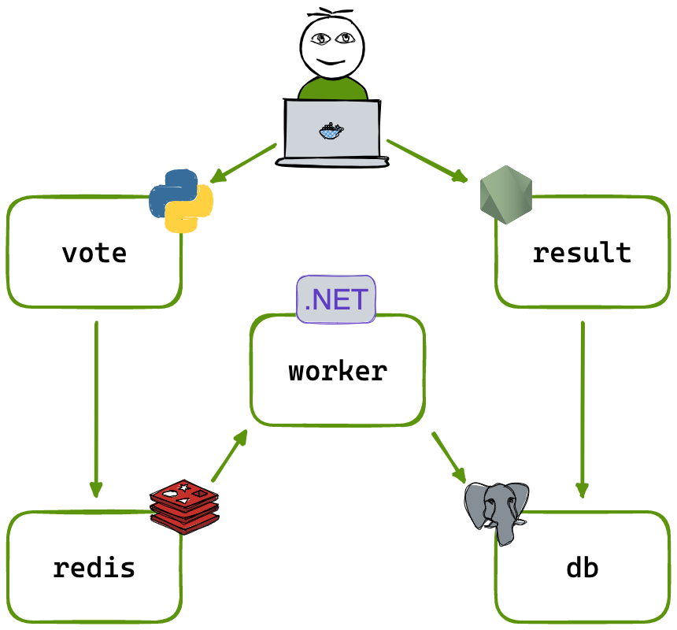

# Voting App on Kubernetes (Kind Multi-Node Cluster)

## Overview

This project demonstrates a **distributed microservices-based voting application** deployed on a local **multi-node Kubernetes cluster using Kind (Kubernetes IN Docker)**.

The cluster simulates a real-world Kubernetes environment with:
- 1 Control Plane Node
- 2 Worker Nodes

It provides hands-on experience with Kubernetes orchestration, networking, service discovery, and workload scheduling.

---

## Architecture

  

---

## Project Workflow

The application follows a microservices-based architecture where each service runs independently inside Kubernetes Pods and communicates via Kubernetes Services.

### Services Flow

- **Voting App (Python)** → User interface for submitting votes  
- **Redis** → In-memory message queue for vote storage  
- **Worker (.NET Service)** → Processes votes from Redis  
- **PostgreSQL** → Stores persistent voting data  
- **Results App (Node.js)** → Displays live voting results  

---

## Kubernetes Deployment

All services were deployed using **pre-built Docker Hub images** and managed through Kubernetes manifests.

### Components Deployed

- 5 Deployments:
  - Vote App
  - Worker
  - Result App
  - Redis
  - PostgreSQL

- 4 Services:
  - Vote Service (NodePort)
  - Result Service (NodePort)
  - Redis Service (ClusterIP)
  - PostgreSQL Service (ClusterIP)

---

## Key Features

- Multi-node Kubernetes cluster using Kind
- Microservices-based architecture
- Docker Hub image-based deployments
- Kubernetes Deployments & ReplicaSets
- NodePort exposure for external access
- Internal service discovery using ClusterIP
- Pod scheduling across worker nodes
- Full container orchestration lifecycle

---

## External Access

External users access the system using **NodePort Services**:

- Voting UI → Vote Service (NodePort)
- Results UI → Result Service (NodePort)

Internal communication is handled via Kubernetes service discovery.

---

## Technologies Used

- Kubernetes
- Kind (Kubernetes IN Docker)
- Docker
- Docker Hub
- YAML
- kubectl
- Python
- Node.js
- .NET Worker Service
- Redis
- PostgreSQL
- Linux
- Microservices Architecture

---

## Key Learnings

This project helped develop practical understanding of:

- Kubernetes cluster setup (multi-node using Kind)
- Container orchestration concepts
- Microservices communication
- Kubernetes networking (ClusterIP & NodePort)
- Service discovery inside clusters
- Pod scheduling across nodes
- Deployment and scaling using Kubernetes manifests
- Debugging distributed systems in Kubernetes

---